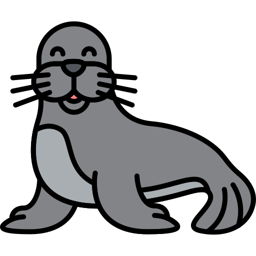
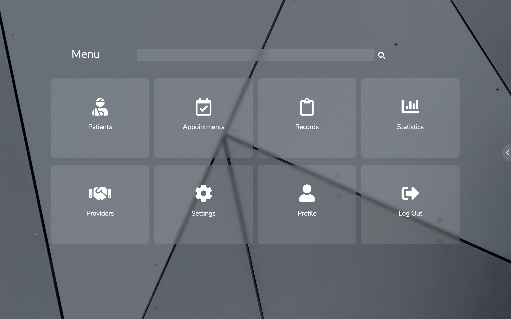

<h1>Sealena</h1>

  

<h3 align="center">Sealena</h3>
<h4 align="center">Medical Information Management and Collaboration Software</h4>
<h2>About Sealena</h2>

Sealena is a medical information management and collaboration software, built to help health workers organize their information, be able
to access it from anywhere and at any time, as well to collaborate and connect with other users from all over the world, all in a single platform.

Sealena provides easy ways to manage all the users patients in a single place. Add, remove, update patient's information as well as
contacting them, Sealena got's your covered. Patients have their own medical record that allowed users are able to create or update whenever is needed and be sure that their information is safe.

Appointments and Consult management is other of the main features of Sealena. Users can create appointments for any date and time.
Confirmation, updating of dates or appointment cancellation can be accomplished afterwards. Appointment reminders are sent any time an appointment is confirmed, this way there is no chance the client misses their consult appointments and attend them.

Laboratories, medical providers or single visitors, any kind of provider can be managed with Sealena and contacted by the user as well.

In order to bring all the healthcare community closer, the exchanging of ideas and knowledge, we need a way to connect together. With Sealena
we are able to accomplish this task, users are able to connect with other users from all over the globe with a single click and start talking to
each other of any topic.

These are some of the main features of Sealena. We are aiming to become the top Medical Information Management and Collaboration platform for healthcare workers, we are constantly supporting and adding new features in order to ease and improve users day to day activites.

<h2>Preview</h2>
<table>
    <tbody>
        <td></td>
        <td></td>
    </tbody>
</table>
<h2>Future Vision</h2>

Currently, Sealena resides only in the web platform. We are working in the arrival to other platforms such as:

<ul>
  <li>IOS</li>
  <li>Android</li>
  <li>Windows</li>
</ul>

We will be moving to Enterprise level, and also provide companies such as Hospital Chains a centralized way to distribute patients to their respective doctors. As well a way for Laboratories to advertise their services and grow their clientes flow.

Patients also have a place in these future innovations. We will provide patients a place to store all their medical records, request appointments remotely and be able to talk to their primary care doctor.

We are aiming to become the top Medical Information Management and Collaboration platform. A centralized place where individuals can store their medical information safely and access it from anywhere at any time without any problems.

<h2>Features</h2>

These are some of the core features of Sealena:

<ul>
  <li>Patients medical background management</li>
  <li>Appointments and Consult management</li>
  <li>Assistants Linking</li>
  <li>Data Statistics</li>
  <li>Collaboration with colleagues from all over the globe</li>
</ul>
<h2>Technologies Used</h2>

Technologies we used for our Back-End:

<ul>
    <li>Python</li>
    <li>Django</li>
</ul>

There are many reasons why Python/Django was the way to go to build Sealena. In the main reasones we have the variety of tools they provide out of the box, the security and mainly the scalability. As mentioned in the previous section, our target is to make Sealena the top Medical Information Management and Collaboration platform and scale larger.

Technologies we used for the Front-End:

<ul>
    <li>HTML</li>
    <li>CSS</li>
    <li>JavaScript</li>
</ul>

We wanted Sealena to be a Web Platform, we used these technologies to build it. We will be using other technologies in the future to provide users
   a better User Experience (UX).

Technologies we used for Data Visualization:

<ul>
    <li>D3.js</li>
</ul>

We decided to use D3.js as our Data Visualization library. D3 eases the way we give life to our data by providing us with tools out of the box
   to manipulate and visulize data instantly. By making use of Canvas or SVG we were able to build up dynamic visualizations based on the data retrieved
   from our server.
 

<h2>Contact</h2>

Luis Adolfo Rodriguez Lopez - <a href="https://www.linkedin.com/in/luis-adolfo-rodriguez-661b2a1b4" target="_blank">LinkedIn</a>
 
